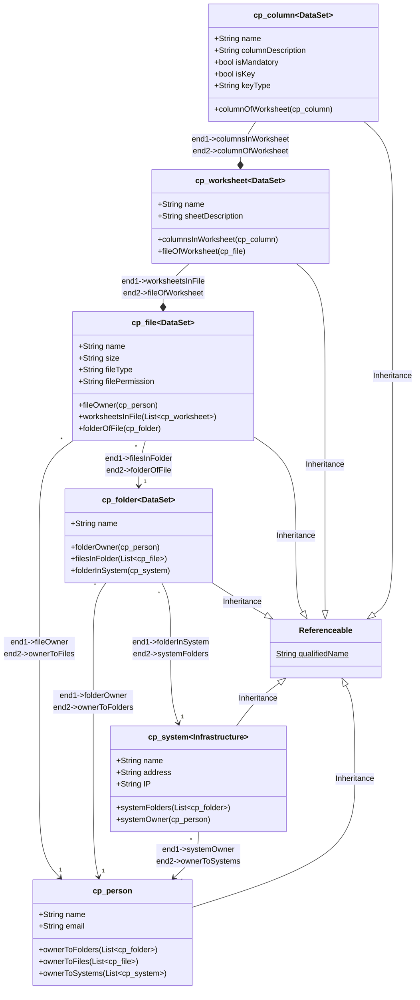

# apache-atlas-custom-type

## Overview
This repository contains JSON templates that can be executed on the Apache Atlas API for creation of custom type defintions 


## Excel Model Example

This folder contains
```bash

1. full_model [folder] --> which contains artifacts to create the final model in Apache Atlas.

2. person_entity_def.json --> person_entity_def.json

```


## Excel Model Definition

Below is the example of our model. We have a system instance called `cp_system` that is owned by a person (aka `cp_person`) and contains folders of type `cp_folder` where we store files of type `cp_files`, each of which includes worksheets of type `cp_worksheet` that enable us to store tabular data with columns of type `cp_column`. The entities are also connected, giving each link a different name.

  



  

## What's next
Once the model is created, we need to push data using rest API interface. We can learn more about them on the blog post itself.s to create the final model in Apache Atlas. 
Person Entity Definition.json
```

## Excel Model Definition

Below is the example of our model. We have a system instance called `cp_system` that is owned by a person (aka `cp_person`) and contains folders of type `cp_folder` where we store files of type `cp_files`, each of which includes worksheets of type `cp_worksheet`  that enable us to store tabular data with columns of type `cp_column`. The entities are also connected, giving each link a different name.


## What's next

Once the model is created, we need to push data using rest API interface. We can learn more about them on the blog post itself.
